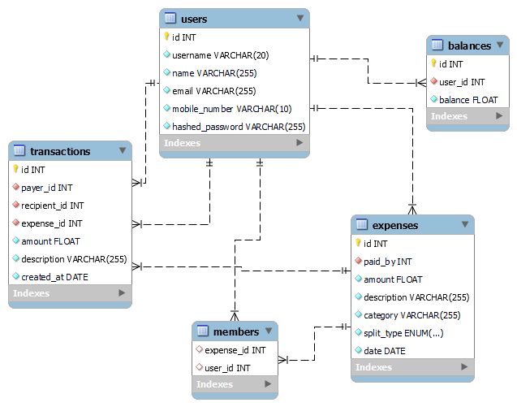

# Splitwise

- [Splitwise](#splitwise)
  - [About](#about)
  - [Local Setup](#local-setup)
  - [Run Application](#run-application)
  - [ER Diagram](#er-diagram)
  - [APIs](#apis)

## About

Backend for Splitwise Like Expense Sharing App

## Local Setup

```powershell
set FLASK_APP=.
set FLASK_ENVIRONMENT=development
set FLASK_DEBUG=True
```

```shell
>>> from Splitwise.models import db
>>> db.create_all()   
```

## Run Application

```powershell
flask --app . run --debug
```

## ER Diagram



## APIs

- [Swagger API endpoint](http://localhost:5000/swagger-ui/)

Currently there are few APIs only

- [Signup](http://localhost:5000/api/users/signup)
  - params: username, name, email, mobile_number, password

- [Login](http://localhost:5000/api/users/login)
  - params: username, password

- [Logout](http://localhost:5000/api/users/logout)

- [Expenses](http://localhost:5000/api/expenses)
  - params: paid_to, amount, description, split_type, split_values, owed_by

- [Expense Detail/ Delete](http://localhost:5000/api/expenses/<int:id>)
  - endpoint should contain `id` of that expense

- [User Transactions](http://localhost:5000/api/user/transactions)
- [Create Transactions](http://localhost:5000/api/transactions)
  - params: recipient_id, amount, description

- [User Balance](http://localhost:5000/api/user/balance)